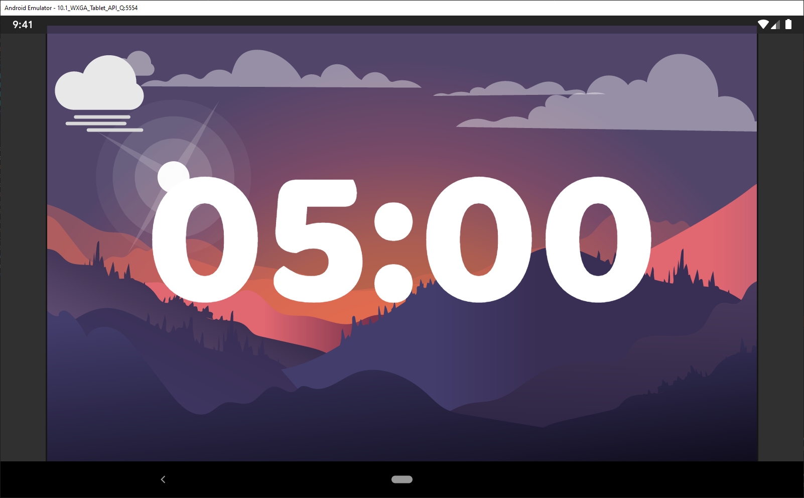
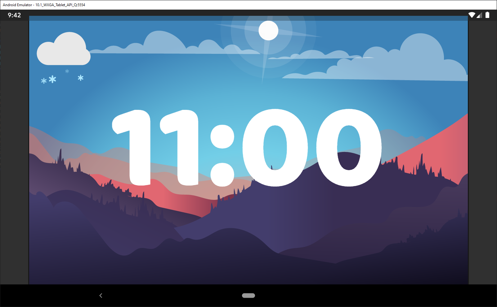
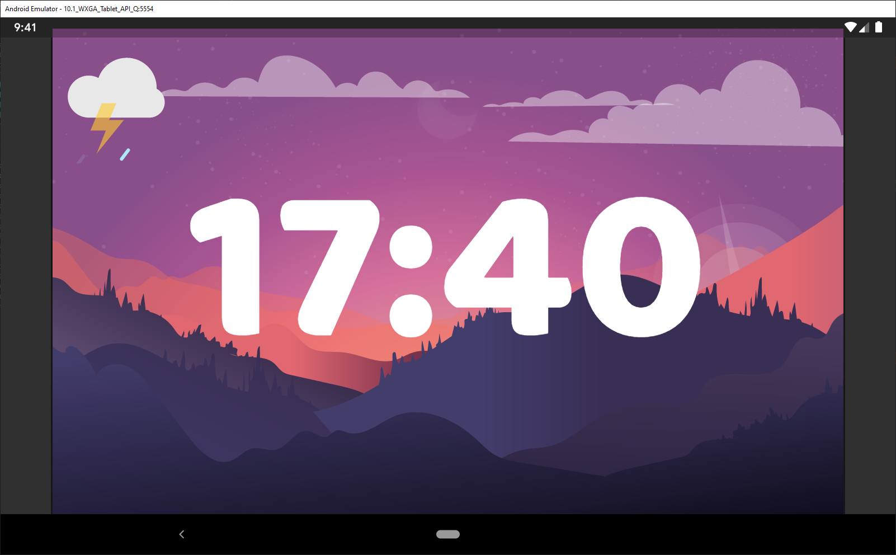
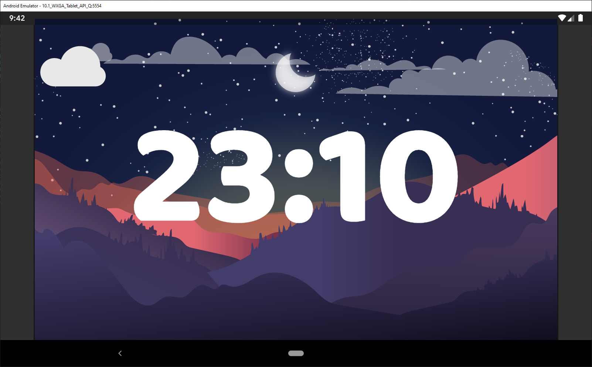

# Scenery Clock
Scenery Clock uses storytelling to visualise what is the current time of day and weather with beautiful animations and
 immersive day-night transitions.
 
Checking the time or weather never was so pleasant and emotionally connected before.

# Day/Night cicle

# Morning

# Day

# Evening

# Night
